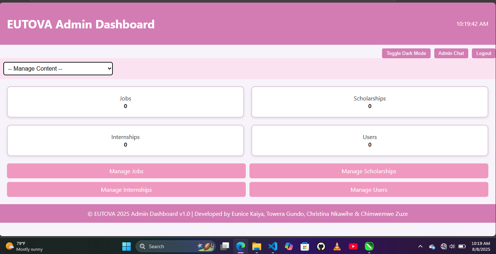

# 🌍 EUTOVA PLATFORM

**EUTOVA** is a dynamic web platform built to connect individuals with opportunities such as **jobs, scholarships, internships, grants**, and more. Designed to empower users through easy access to life-changing opportunities, EUTOVA aims to be a reliable, inclusive, and user-friendly portal.

## 🔧 Technologies Used

- **Frontend**: HTML5, CSS3, JavaScript
- **Backend**: PHP (Procedural & OOP)
- **Database**: MySQL
- **Styling Frameworks**: CSS custom, optional Bootstrap integration
- **Other Tools**: Font Awesome, Chart.js (for admin insights)

## 🎯 Features

### 🌐 User Side:
- View latest job listings, scholarships, and opportunities
- Filter and search opportunities by category or deadline
- Responsive and mobile-friendly interface
- Easy navigation and clean layout

### 🔐 Admin Dashboard:
- Secure login for admins
- Post and manage listings (Jobs, Scholarships, Internships)
- Dashboard analytics and insights (optional)
- User management
- File/image uploads for opportunity banners

## 👩‍💻 Developed By

This platform was proudly developed by:

- **Christina Nkawihe**  
- **Eunice Kaiya**  
- **Towera Gundo**

Powered by ITEC ICT E SOLUTIONS as part of their final Project for 2025 Internship Program (TEVETA ICT STUDENTS)

## ✅ Future Improvements
- Email notifications for new listings
- User signup/login to save favorite posts
- API integration with external job boards
- Newsletter subscription system

## 📌 License
This project is currently for educational and developmental use. Distribution or commercial use requires permission from the authors.

## 🖼️ Screenshots

Here are a few screenshots of the EUTOVA platform interface:

### 🔐 Login Page

### 📝 Register Page

### 📊 Admin Dashboard

**Thank you for exploring EUTOVA — Empowering You Through Opportunity.**
